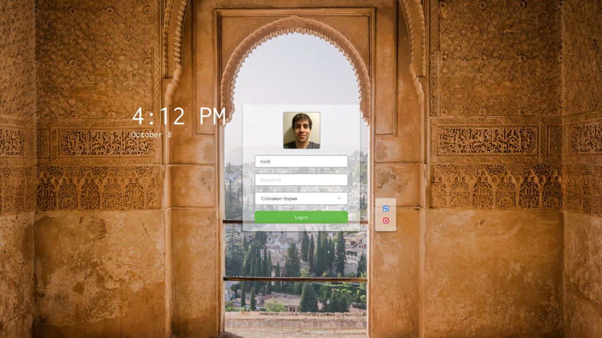

# Frost SDDM Theme

A simple theme for [SDDM][]. The theme has only been tested for 3200x1800 and
might not scale well at other resolutions.

Thanks to:

* [Victoriano Izqueirdo][bg] for the background image.
* Alfredo Ramos for creating the [Urban Lifestyle SDDM theme][urban], which was
  extremely helpful as an example of how to make a theme.
* Nazar Gerasymchuk for [this blog post][round] describing how to make a
  rounded image with QtQuick.

[SDDM]: https://github.com/sddm/sddm
[bg]: https://unsplash.com/@victoriano
[urban]: https://github.com/AlfredoRamos/sddm-urbanlifestyle-theme
[round]: http://tro.trola.org/wp/rounded-images-in-qtquickqml/
